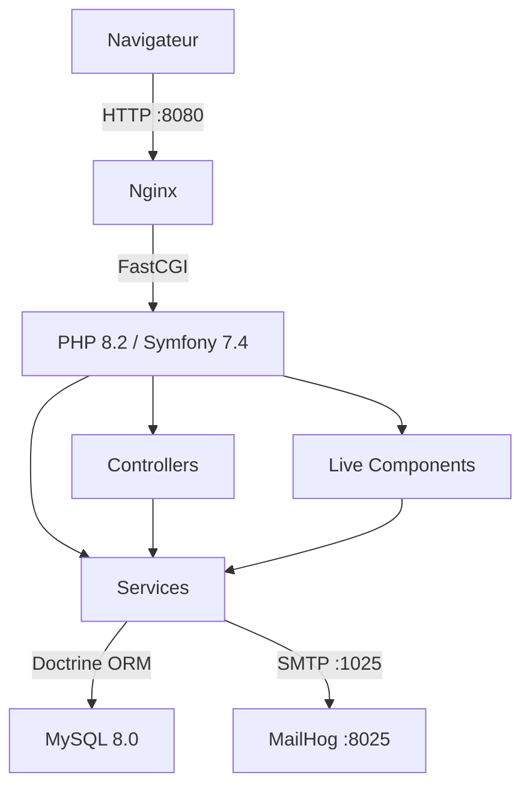

# Document d'architecture — FightClubPortal

## Vue d'ensemble

FightClubPortal est une application web Symfony 7.4 permettant la gestion d'un processus d'inscription sécurisé avec validation administrative.

## Architecture générale



## Structure du projet

```
src/
├── Command/
│   └── ValidateUserCommand.php     # Commande CLI de validation admin
├── Controller/
│   ├── LoginController.php         # Authentification
│   ├── PortalController.php        # Portail membres
│   ├── RegistrationController.php  # Inscription
│   └── SetPasswordController.php   # Création mot de passe
├── Entity/
│   └── User.php                    # Entité principale
├── Form/
│   └── RegistrationFormType.php    # Formulaire d'inscription
├── Repository/
│   └── UserRepository.php          # Requêtes base de données
├── Service/
│   ├── RegistrationService.php     # Logique métier d'inscription
│   └── UserValidationService.php   # Logique métier de validation
└── Twig/
    └── Components/
        └── RegistrationFormComponent.php  # Live Component formulaire
```

## Choix techniques

### Symfony UX Live Components
Utilisé pour le formulaire d'inscription afin de fournir une expérience interactive sans écrire de JavaScript custom. Le composant gère la soumission via AJAX et redirige vers une page de confirmation.

### AssetMapper
Choisi à la place de Webpack Encore car mieux intégré avec Symfony UX et ne nécessite pas de Node.js dans l'environnement de production. Les assets sont servis directement sans étape de compilation.

### Services métier
La logique métier est extraite des controllers dans des services dédiés (`RegistrationService`, `UserValidationService`) afin de respecter le principe de responsabilité unique (SRP).

### Sécurité
- Mots de passe hashés via `UserPasswordHasherInterface`
- Tokens de validation générés avec `random_bytes(32)` (CSPRNG)
- Protection CSRF sur tous les formulaires
- Accès au portail restreint aux utilisateurs authentifiés (`ROLE_USER`)
- Numéros de sécurité sociale validés par regex

## Environnement Docker

| Service | Image | Port |
|---|---|---|
| php | Custom (PHP 8.2-fpm) | — |
| nginx | nginx:alpine | 8080 |
| mysql | mysql:8.0 | 3306 |
| mailhog | mailhog/mailhog | 8025 |
