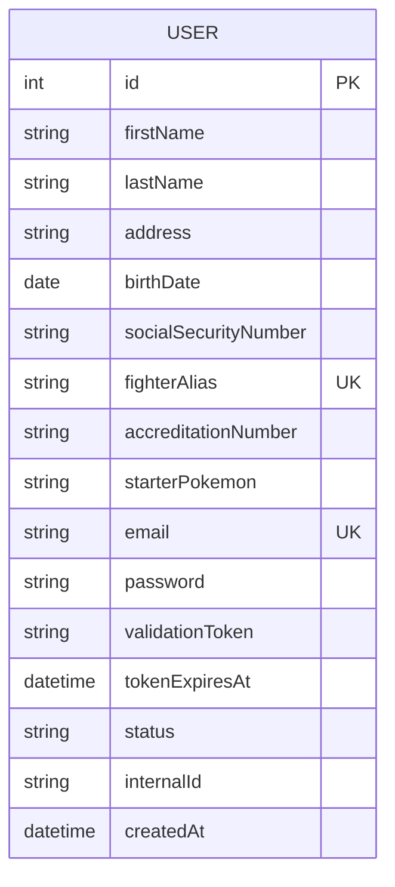
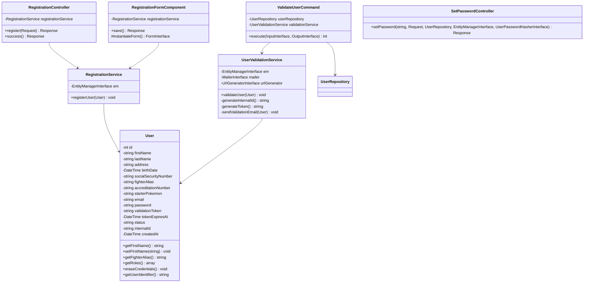
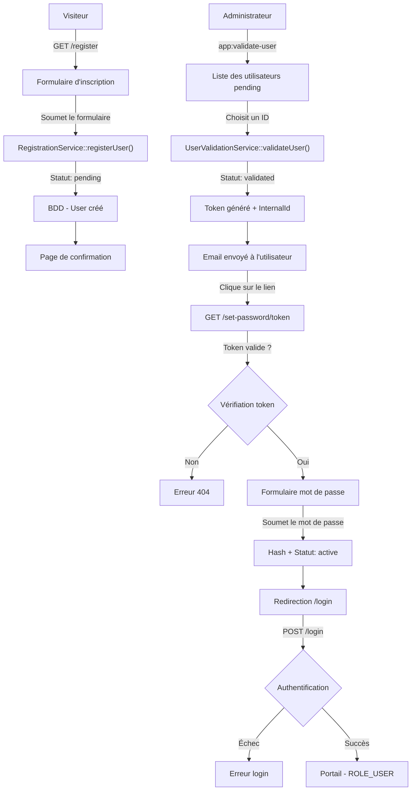

# Diagrammes — FightClubPortal

## Schéma relationnel

```mermaid
erDiagram
    USER {
        int id PK
        string firstName
        string lastName
        string address
        date birthDate
        string socialSecurityNumber
        string fighterAlias UK
        string accreditationNumber
        string starterPokemon
        string email UK
        string password
        string validationToken
        datetime tokenExpiresAt
        string status
        string internalId
        datetime createdAt
    }
```

## Diagramme de classes UML

```mermaid
classDiagram
    class User {
        -int id
        -string firstName
        -string lastName
        -string address
        -DateTime birthDate
        -string socialSecurityNumber
        -string fighterAlias
        -string accreditationNumber
        -string starterPokemon
        -string email
        -string password
        -string validationToken
        -DateTime tokenExpiresAt
        -string status
        -string internalId
        -DateTime createdAt
        +getFirstName() string
        +setFirstName(string) void
        +getFighterAlias() string
        +getRoles() array
        +eraseCredentials() void
        +getUserIdentifier() string
    }

    class RegistrationService {
        -EntityManagerInterface em
        +registerUser(User) void
    }

    class UserValidationService {
        -EntityManagerInterface em
        -MailerInterface mailer
        -UrlGeneratorInterface urlGenerator
        +validateUser(User) void
        -generateInternalId() string
        -generateToken() string
        -sendValidationEmail(User) void
    }

    class RegistrationController {
        -RegistrationService registrationService
        +register(Request) Response
        +success() Response
    }

    class ValidateUserCommand {
        -UserRepository userRepository
        -UserValidationService validationService
        +execute(InputInterface, OutputInterface) int
    }

    class RegistrationFormComponent {
        -RegistrationService registrationService
        +save() Response
        #instantiateForm() FormInterface
    }

    class SetPasswordController {
        +setPassword(string, Request, UserRepository, EntityManagerInterface, UserPasswordHasherInterface) Response
    }

    RegistrationController --> RegistrationService
    RegistrationFormComponent --> RegistrationService
    ValidateUserCommand --> UserValidationService
    ValidateUserCommand --> UserRepository
    RegistrationService --> User
    UserValidationService --> User
```

## Diagramme de flux UML

```mermaid
flowchart TD
    A["Visiteur"] -->|"GET /register"| B["Formulaire d'inscription"]
    B -->|"Soumet le formulaire"| C["RegistrationService::registerUser()"]
    C -->|"Statut: pending"| D["BDD - User créé"]
    D --> E["Page de confirmation"]

    F["Administrateur"] -->|"app:validate-user"| G["Liste des utilisateurs pending"]
    G -->|"Choisit un ID"| H["UserValidationService::validateUser()"]
    H -->|"Statut: validated"| I["Token généré + InternalId"]
    I --> J["Email envoyé à l'utilisateur"]

    J -->|"Clique sur le lien"| K["GET /set-password/token"]
    K -->|"Token valide ?"| L{"Vérifiation token"}
    L -->|"Non"| M["Erreur 404"]
    L -->|"Oui"| N["Formulaire mot de passe"]
    N -->|"Soumet le mot de passe"| O["Hash + Statut: active"]
    O --> P["Redirection /login"]

    P -->|"POST /login"| Q{"Authentification"}
    Q -->|"Échec"| R["Erreur login"]
    Q -->|"Succès"| S["Portail - ROLE_USER"]
```
